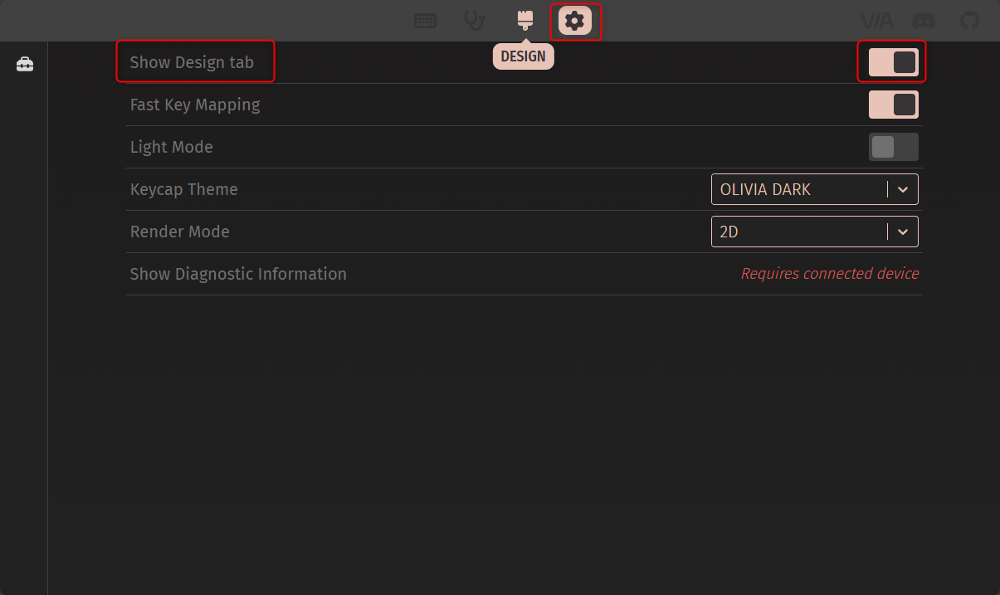
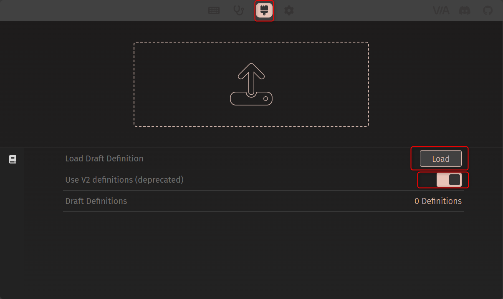
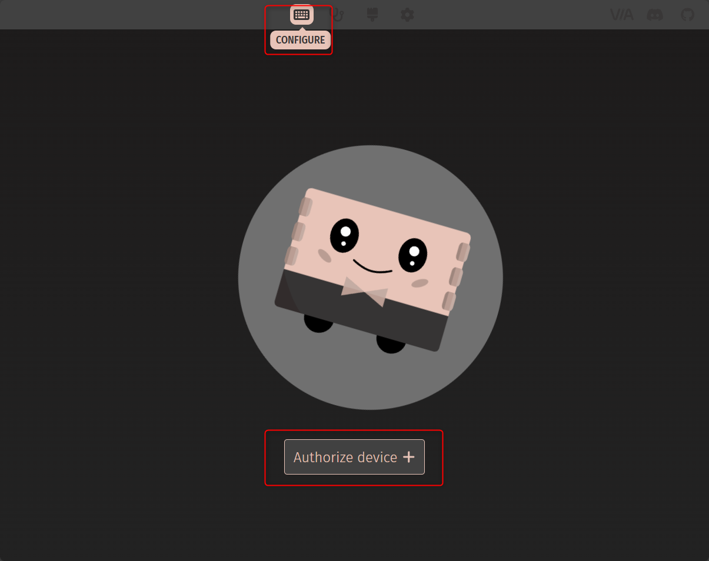
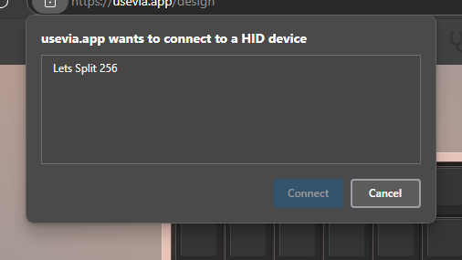
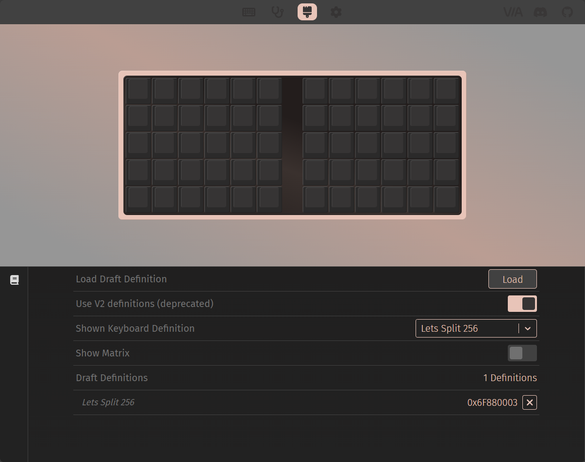
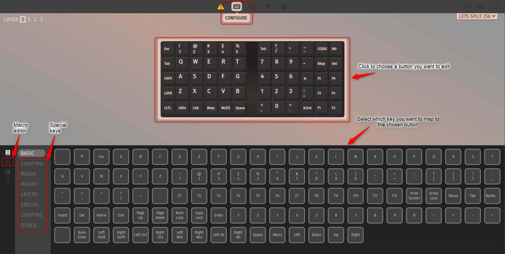
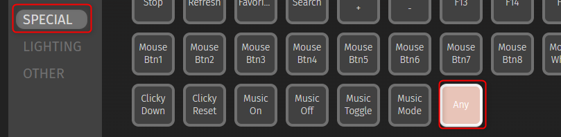
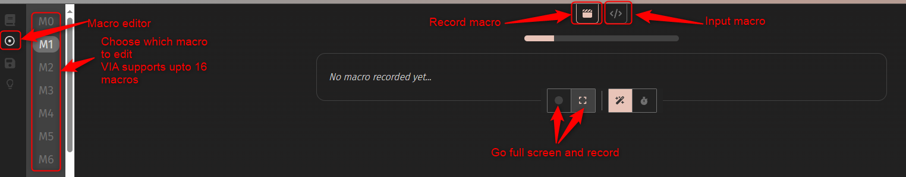
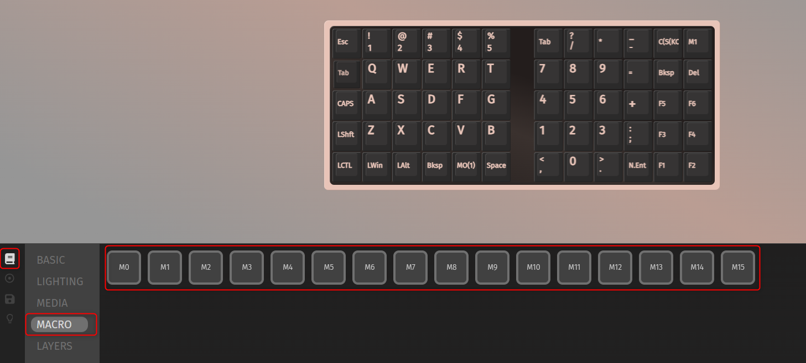

Use VIA to modify keymap of the "Let's split 265" keyboard

# Table of Contents
- [Table of Contents](#table-of-contents)
- [Reference:](#reference)
- [Set up VIA keymap editor](#set-up-via-keymap-editor)
- [Map special keys and key combinations](#map-special-keys-and-key-combinations)
  - [Any](#any)
  - [Macro](#macro)
    - [Record/Input macros](#recordinput-macros)
    - [Use macros](#use-macros)
- [Layers](#layers)

# Reference:
- [https://docs.keeb.io/via](https://docs.keeb.io/via)
- [https://docs.qmk.fm/keycodes](https://docs.qmk.fm/keycodes)
# Set up VIA keymap editor
- Download file [lets_split_256_via.json](lets_split_256_via.json)
- Plug the keyboard in
- Use a Chromium-based browser like Chrome or Edge (Firefox is not supported), and go to [https://usevia.app/](https://usevia.app/)
- In usevia.app, go to `SETTING` tab, turn on `Show Design tab`
   
- Go to `DESIGN` tab, turn on `Use V2 definition` then click `Load` and load file `lets_split_256_via.json` you just downloaded
   
- You should be prompted to connect to the keyboard. (If not prompted, go to `CONFIGURE` tab, click on `AUTHORIZE DEVICE`.) Then Select `Let's split 265`, click `Connect`
   
   
   
- Go to `CONFIGURE` tab to start keymap editing
   

# Map custom key combinations
VIA supports some ways to map custom key combinations
## Any
Choose a button to map, go to `Special`, click `Any` key then input any QMK supported key or key combination for the chosen button.

For all supported keycodes, see [https://docs.qmk.fm/keycodes](https://docs.qmk.fm/keycodes)

Some basic keys: [Full list](https://docs.qmk.fm/keycodes#basic-keycodes)
- `KC_<letter>` as letter key, e.g. `KC_C` is letter C,
- `KC_<number>` as number key, e.g. `KC_3` is number 3,
- `KC_DEL`, `KC_DELETE` = Delete
- `KC_BACKSPACE`, `KC_BSPC` = Backspace
- `KC_ENTER`, `KC_ENT` = Enter
- `KC_LSFT` = Left Shift, `KC_LCTL` = Left Ctrl
- `KC_ESC`, `KC_SPC`
- `KC_COMMA`, `KC_DOT`, `KC_SEMICOLON`
- ...

Some modifiers: [Full list](https://docs.qmk.fm/keycodes#modifiers)
Modifier can be used to create key combinations
- `C(KC_<key>)`, `LCTL(KC_<key>)`, `RCTL(KC_<key>)` = Hold Ctrl and press \<key\>
- `S(KC_<key>)`, `LSFT(KC_<key>)`, `RSFT(KC_<key>)` = Hold Shift and press \<key\>
- `A(KC_<key>)`, `LALT(KC_<key>)`, `RALT(KC_<key>)` = Hold Alt and press \<key\>
- `LCA(KC_<key>)` = Hold Left Control, Left Alt and press \<key\>
- `LSA(KC_<key>)` = Hold Left Shift, Left Alt and press \<key\>
- ...

Examples:
- `C(KC_C)` = Ctrl + C, `C(KC_C)` = Ctrl + V
- `S(KC_ENT)` = Shift + Enter
- `C(S(KC_F))` = Ctrl + Shift + F
- `LCA(KC_DEL)` = Ctrl + Alt + Del

## Macro
You can record or input some complex key combinations/ macros using this feature.
### Record/Input macros

### Use macros

# Layers
(to be updated)
